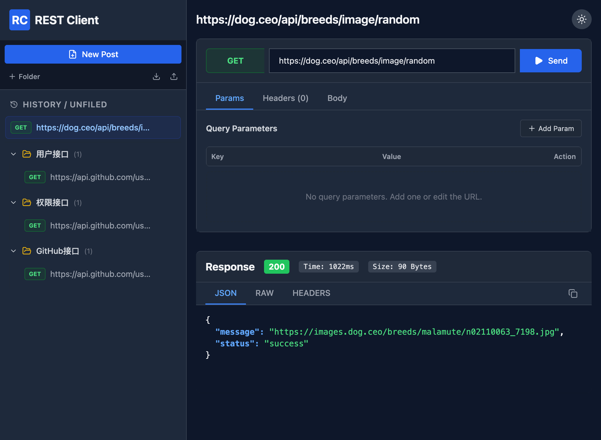

# RestClient

**RestClient** 是一款结合了 **Rust (Tauri 2.0)** 极致性能与 **React** 现代化交互体验的开源 API 调试工具。它告别了 Electron 的臃肿，为您提供轻量、极速且美观的接口调试体验。

[](./LICENSE)
[](https://github.com/wumacms/RestClient/stargazers)
[](https://tauri.app/)
[](https://react.dev/)



## ✨ 项目亮点

-   🚀 **极致轻量**: 基于 **Tauri 2.0** 构建，利用 Rust 编写原生后端，冷启动飞快，内存占用远低于同类 Electron 应用。
-   �️ **全能请求构建**: 深度支持 GET, POST, PUT, DELETE 等全量 HTTP 方法。内置智能 Query 解析、Header 管理及 JSON/Text 格式化编辑器。
-   📂 **智能工作流管理**: 创新的**文件夹管理**系统，支持通过**拖拽 (Drag & Drop)** 快速整理请求历史与收藏，让工作流井井有条。
-   🎨 **极致美学设计**: 完美适配**深色/浅色模式**，一键随系统切换。内置 JSON 语法高亮响应面板，美感与实用并重。
-   🌐 **为全球开发者打造**: 原生支持**中英文 (Chinese/English)** 一键切换，让沟通与协作无国界。
-   📊 **增强预览生态**: 自动识别响应，支持 **Markdown 渲染**及**图片、音频、视频**等多媒体文件的直接预览播放。
-   🦀 **高能硬件加速**: 桌面端底层由 Rust `reqwest` 驱动，直达硬件层级的请求效率，且彻底告别浏览器跨域限制。

## 🏗️ 技术脉络

| 维度 | 技术栈 | 价值点 |
| :--- | :--- | :--- |
| **桌面内核** | [Tauri 2.0](https://tauri.app/) & [Rust](https://www.rust-lang.org/) | 系统级安全，极高的运行速度与轻小的体积 |
| **视图交互** | [React 19](https://react.dev/) | 先进的并发渲染机制，交互丝滑顺畅 |
| **逻辑构建** | [TypeScript](https://www.typescriptlang.org/) | 类型安全，大幅减少线上运行时错误 |
| **打包构建** | [Vite 6](https://vitejs.dev/) & [pnpm](https://pnpm.io/) | 极致的 HMR 体验与高效的依赖管理 |
| **界面样式** | [Tailwind CSS](https://tailwindcss.com/) | 原子级 CSS 框架，确保响应式布局与极速开发 |

## 🚀 如何使用

### 途径一：下载安装即用 (推荐)
直接从 [GitHub Releases](https://github.com/wumacms/RestClient/releases) 下载适配您系统的安装包：
- **Windows**: 下载 `.msi` 或 `setup.exe`（暂未上传）。
- **macOS**: 下载 `.dmg` 文件（已上传）。
- **Linux**: 支持 `.AppImage` 或 `.deb` 格式（暂未上传）。

**macOS 打开应用时提示“已损坏”的解决办法**:
> 由于未进行 Apple 官方公证，安装后若提示“已损坏”或“无法验证开发者”，请打开 **终端 (Terminal)** 并执行：
> ```bash
> sudo xattr -rd com.apple.quarantine /Applications/RestClient.app
> ```

---

### 途径二：源码本地运行 (开发/自编译)

#### 1. 环境准备
开始前请确保您的开发环境已安装：
- [Node.js](https://nodejs.org/) (推荐 v18+)
- [Rust & Cargo](https://www.rust-lang.org/learn/get-started) (构建桌面端必备)
- [pnpm](https://pnpm.io/) (包管理)

#### 2. 快速运行
```bash
# 克隆仓库
git clone https://github.com/wumacms/RestClient.git
cd RestClient

# 安装依赖
pnpm install

# 启动 Web 版 (浏览器访问 http://localhost:3000)
pnpm run dev

# 启动桌面 Debug 版
pnpm tauri dev
```

#### 3. 自行构建产物
若需生成优化的生产包，请运行：
```bash
pnpm tauri build
```
编译完成后，安装包将存放在 `src-tauri/target/release/bundle/` 目录下。

> 💡 **进阶提示**: 推荐通过 [Tauri Action](https://github.com/tauri-apps/tauri-action) 利用 CI/CD 实现自动化、全平台的打包分发。


## 🔄 核心设计理念：异构协同

本工具采用了独特的**“脑壳-框架”**异构设计：
- **Web 视图层**: 承担所有 UI 呈现与用户交互逻辑，Web 与桌面版共享 100% 视图代码。
- **Rust 原生层**: 承担原生能力建设，如高性能网络协议栈、本地文件系统沙盒，并能精准通过 `isTauri()` 实现环境自适应，在桌面端自动启用文件一键定位等高级功能。

## 📜 开源协议

本项目基于 [MIT](./LICENSE) 协议开源。

---

*由 **WumaCMS** 精心打造 · 正在为一个更高效的开发世界而迭代*
